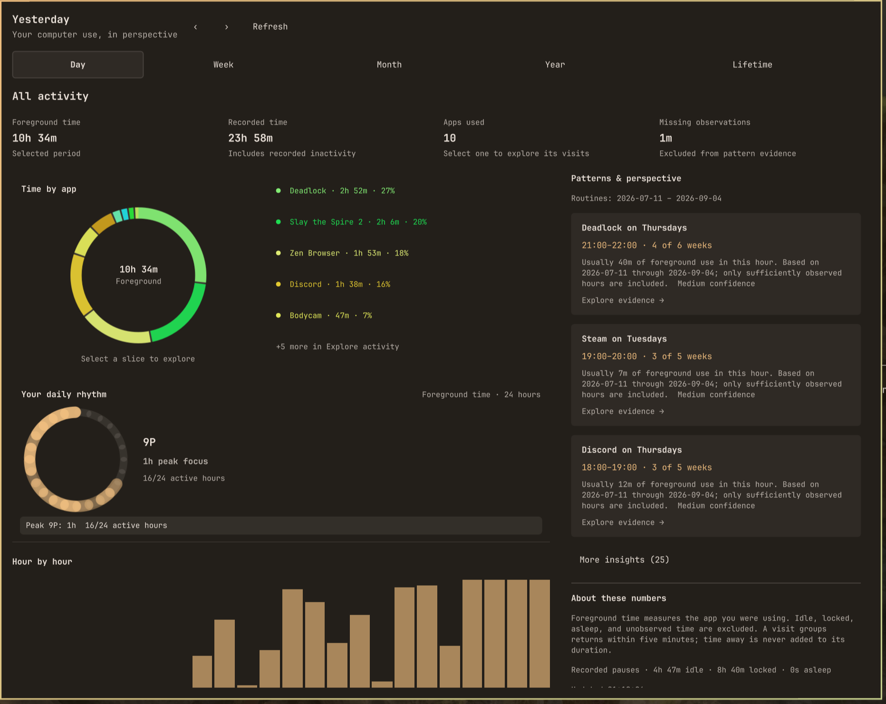
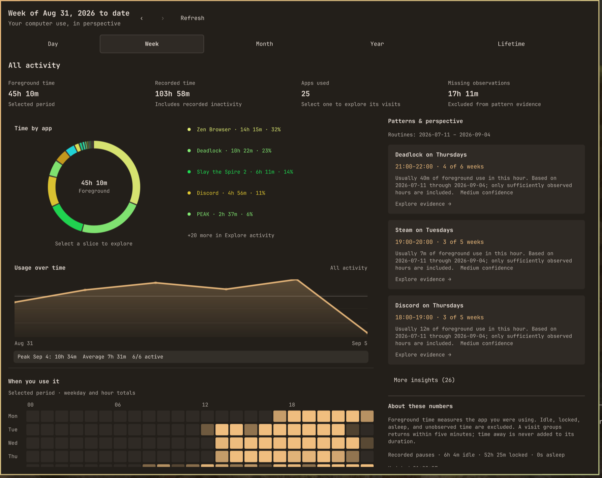
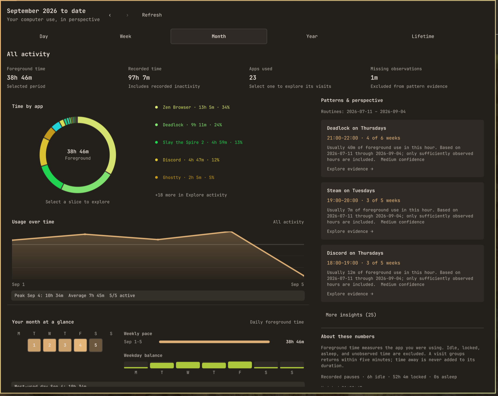

# Omastat

Omastat is a local app focus tracker for Arch/Omarchy desktops running
Hyprland. It records focused window time to a local SQLite database, keeps
open-window telemetry as secondary context, and turns that into CLI reports, a
terminal dashboard, HTML exports, and an Omarchy Quattro widget.



## Quick Start

```bash
cargo install --path crates/omastat --locked
packaging/systemd/install-user-service.sh
packaging/browser-extension/install.sh
omastat doctor
```

For the Omarchy bar widget:

```bash
omarchy plugin add https://github.com/ThisIsRinesi/Omastat.git
omarchy plugin enable local.omastat
```

Click the widget for the analytics panel, middle-click to refresh, and
right-click to toggle icon-only mode.

## Screenshots





## Features

- Focused time by application.
- Idle, locked, asleep, and desktop/portal focus are excluded from focused time.
- Daemon outages and restart recovery gaps are marked as unobserved excluded
  time instead of being counted as active focus.
- Active audio playback keeps idle video or music sessions counted as active
  focus.
- Terminal windows can be attributed to the foreground process, such as `btop`
  or `opencode`, instead of only the terminal emulator.
- Optional Zen/Firefox browser extension reports only the active tab domain, so
  browser focus breakdowns do not need window titles or browser history.
- Steam app IDs and common desktop classes are normalized to readable names.
- Omarchy Quattro widget with a QML analytics panel for day, week, month, year,
  and lifetime totals, searchable apps and websites, activity trends, heatmaps,
  visit statistics, and expandable pattern evidence.
- Rich terminal dashboard with app composition pies, focus-flow charts, hourly
  peaks, heatmaps, workspace focus, focus block stats, and idle, locked, sleep,
  and unobserved signal gauges.
- Structured insights, goals, budgets, weekly digests, and one-line widget
  facts reuse the same local analysis engine.
- App aliases and categories can be configured locally for cleaner labels and
  custom groups and optional CLI budgets.
- Raw and aggregate JSON/CSV exports include local timestamps, app totals,
  daily totals, insights, and excluded system gaps.
- Retention purges support dry-run review, cutoff trimming, and optional
  SQLite vacuuming.
- TUI colors follow Noctalia, skwd-wall/Matugen, or the current Omarchy theme
  when those files are present.
- Static HTML overview export for shareable day, week, month, year, and lifetime dashboards.

## Install From Source

From a checkout or release tarball:

```bash
cargo install --path crates/omastat --locked
packaging/systemd/install-user-service.sh
packaging/browser-extension/install.sh
```

Check the daemon:

```bash
omastat doctor
omastat today
```

The Arch packaging recipe is in [packaging/arch/PKGBUILD](packaging/arch/PKGBUILD).

## Omarchy Widget

The Quattro widget requires the `omastat` binary on `PATH` and the user service
running. Install the plugin from GitHub:

```bash
omarchy plugin add https://github.com/ThisIsRinesi/Omastat.git
omarchy plugin enable local.omastat
```

It appears in the right bar section by default. Move it later with:

```bash
omarchy bar move local.omastat --section right
```

## Explore Your Habits

The widget opens a larger dashboard with charts and insights side by side: a
selectable app/website donut, a 24-hour rhythm ring, shaded usage trends, a
monthly calendar with weekly totals, and weekday/hour heatmaps. Selecting an
activity updates the detailed charts and its supporting insights.
The widget settings include a dashboard width control; smaller widths stack
the content into one column. Search the **Apps** or **Websites** list and select an activity to inspect its
foreground time, days used, visits, typical visit duration, and time-of-week
patterns. Select **All activity** to return to the overview. Click an insight
to explore its supporting dates and sample counts.

Routines look for everyday, weekday, weekend, and specific-weekday habits in
one- and two-hour local-time windows, checked every 15 minutes. Both foreground
use and foreground visit starts can establish a pattern. The preceding 56
completed days form the established baseline; a 14-day baseline catches recent
habits and labels them explicitly. Baselines are independent of the chart lens,
and historical reports never use observations after their cutoff.

Everyday/weekday/weekend routines need five matching dates, at least seven
eligible dates, and a 60% recurrence rate. Specific-weekday routines need three
matching weeks. Each occurrence needs five foreground minutes, and each eligible
window needs 90% recorded coverage. Missing recordings and substantial
unattributed browser time do not count as days you chose not to use an activity.
The detector avoids arbitrary time claims about activity spread across the whole
day, combines duplicate findings, and diversifies the overview across activities.

Expanded evidence shows matching and eligible dates, timing windows, and whether
the pattern is recent or established. Confidence is low below seven occurrences,
medium from seven, and high only with 14 occurrences spanning at least four weeks
and 75% recurrence. Visit starts mean foreground visits, not application launches;
starts clipped by a recording boundary are excluded from start-time evidence.

A visit groups returns to the same app or website within five minutes. Only
foreground seconds contribute to duration; idle, lock, sleep, and recording
gaps break visits. “Typical visit” is the median recorded foreground duration
within the selected period. Website time is a subset of browser time.

Use **Tab** to navigate controls, **Enter/Space** to select, **/** to search,
**R** to refresh, and **Escape** to return to all activity or close the panel.

## Usage

```bash
omastat today
omastat week
omastat summary
omastat summary --lens week --offset -1
omastat widget-summary --lens day
omastat insights --json
omastat activity-detail --lens week --app zen
omastat activity-detail --lens month --domain github.com
omastat tui
omastat export --lens month --output ~/Pictures/omastat-month.html
omastat export-data --lens month --format csv --output ~/omastat-month-csv
```

More command examples and configuration notes are in [docs/USAGE.md](docs/USAGE.md).

## Browser Domains

The browser integration is local and domain-only. The extension listens for the
active tab in Zen/Firefox and sends `github.com`-style host names to
`omastat native-host`; Omastat then counts those domains only where they
overlap with focused browser window time. It does not receive tab titles, full
URLs, page contents, or browsing history.

Run `packaging/browser-extension/install.sh` after installing the binary, then
restart Zen/Firefox. The development reinstall script runs this step too. The extension confirms
its active domain every 30 seconds; unconfirmed attribution expires after
90 seconds. Blank/internal pages and browser focus loss clear the previous
domain. Existing closed historical records are preserved.
Firefox release builds require signed add-ons, so if Zen enforces that policy,
use a temporary development load or a signed XPI for regular browser startup.

## skwd-wall Theme

Omastat can read skwd-wall/Matugen colors from the default skwd cache paths, or
from a dedicated Omastat output. The template and integration notes are in
[packaging/skwd-wall](packaging/skwd-wall).

## Privacy

By default, Omastat stores application class names, timing intervals, browser
domains supplied by the optional local extension, and workspace/monitor context
when Hyprland provides it. It does not store window titles, page names, file
names, screenshots, full URLs, page contents, or browser history.

Optional title capture can be enabled explicitly in the config file when richer
replay labels are worth the extra local data. Zen Browser history enrichment is
also opt-in and read-only. Optional title allowlists and blocklists can restrict
captured titles further, and `omastat purge` can remove older local telemetry
after a dry-run review. See [docs/USAGE.md](docs/USAGE.md).

## Development

```bash
cargo test
cargo run -p omastat -- doctor
cargo run -p omastat --bin omastatd
```

Development workflow notes are in [docs/DEVELOPMENT.md](docs/DEVELOPMENT.md).

## License

MIT
