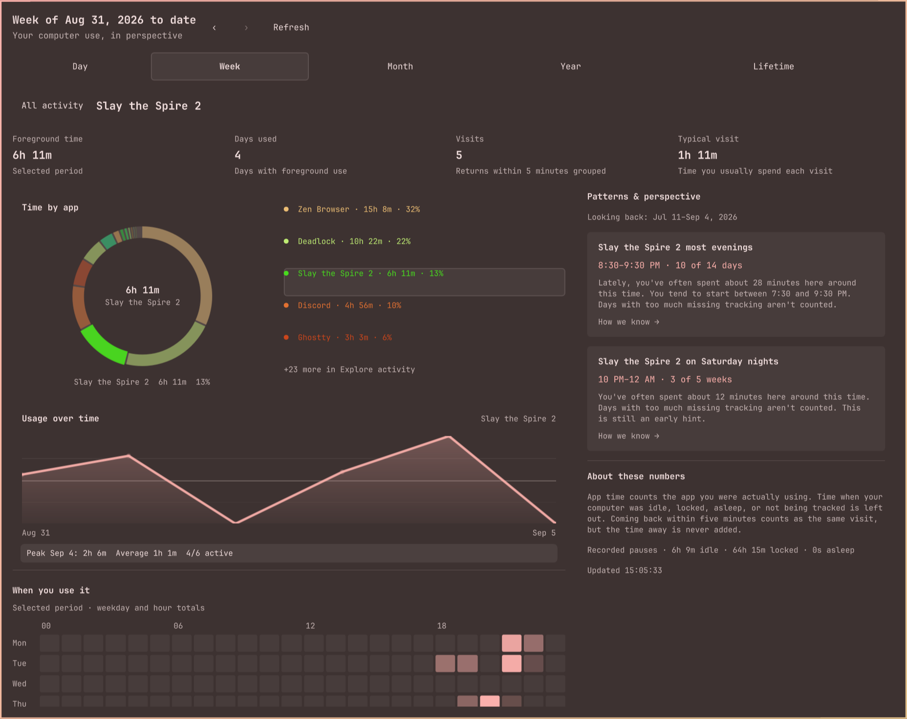

# Omastat

**Your computer use, in perspective.**

Omastat is a personal activity dashboard that lives in your Omarchy bar. Click
its widget to see where your time went, explore an app or website, and notice
the routines that emerge over time. Tracking runs in the background and stays
on your machine.

Built for **Arch Linux, Hyprland, and the Omarchy Quattro shell**.


## Start with a glance. Follow your curiosity.

The bar shows your focused time. Open it for the full dashboard:

- **See the bigger picture.** Switch between day, week, month, year, and lifetime,
  or step back through earlier periods.
- **Find where your time went.** Select a slice of the app chart, or search the
  Apps and Websites lists. Its charts follow your selection; app and website shares keep the overall period breakdown.
- **Explore your rhythm.** See your busiest hours, daily trends, monthly calendar,
  and the times of the week you tend to use an activity.
- **Understand your visits.** Inspect time spent, days used, visit counts, and
  typical visit length. Brief returns are grouped together; time away isn't
  added to your usage.
- **Notice habits you recognize.** Read insights in everyday language and open
  their evidence to see what supports them.

### Habits, with the evidence behind them

An evening game can be a routine even when you don't start at exactly the same
minute. Omastat looks for recurring use across flexible time windows, including
recent habits and longer-running routines. Days with too much missing tracking
are left out of the comparison.



*Selecting Slay the Spire 2 reveals an evening routine, its timing, and how often
it appeared. Routine evidence looks across recent history; the charts show the
selected period.*

Insights take time to develop. A fresh install starts collecting from that point
on, and early hints are labeled accordingly. Open **How we know** on an insight
to inspect its supporting details. Counting rules and tracking gaps are available
under **About your data**, leaving the main dashboard focused on your activities.

### Today and the month ahead


*The day view shows your app mix and when you were active.*


*The month view groups your daily trends and calendar under **Your rhythm**.
Scroll to explore the calendar, weekday totals, and activity list.*

These panel captures use the current desktop theme and a snapshot of real local
activity. Your colors and totals will follow your own setup.

## Install

You'll need a running Hyprland session, the Omarchy Quattro shell with plugin
support, Git, jq, and a Rust toolchain with Cargo and a C compiler. The widget uses
the `omastat` binary and its background user service; the installer sets up both.

```bash
git clone https://github.com/ThisIsRinesi/Omastat.git
cd Omastat
./install.sh
```

The script builds both backend commands in `~/.cargo/bin`, starts the tracking
service, and installs and enables the plugin. Run it as your normal desktop user,
without `sudo`. Make sure `~/.cargo/bin` is on your session's `PATH` for CLI use.
The widget appears on the right side of the bar by default. Activity begins accumulating while the service
runs; no manual timer is needed.

| Control | Action |
| --- | --- |
| Click the bar widget | Open the dashboard |
| Middle-click the bar widget | Refresh |
| Right-click the bar widget | Toggle icon-only mode |
| Select an app, website, or chart slice | Explore that activity |
| Select a calendar day or trend point | Open its day, month, or week, keeping the selected activity |
| Today / This week / This month / This year | Return to the current period |
| All activity | Return to the overview |
| Tab, then Enter or Space | Navigate and select controls |
| `/` | Search activities |
| `R` | Refresh the dashboard |
| Escape | Return to all activity or close the panel |

Widget settings include refresh frequency and dashboard width. Narrower panels
stack their content into one column.

### Optional: website breakdowns

App tracking works without a browser extension. To add domain-level breakdowns
for Zen or Firefox, install the local browser integration, then restart your
browser:

```bash
./install.sh --with-browser
```

The installer needs `zip`. Firefox release builds require signed add-ons; browsers
that enforce signing need a signed XPI for persistent use, or a temporary
extension load for development. For a temporary load, open `about:debugging#/runtime/this-firefox`, choose
**Load Temporary Add-on**, and select the generated XPI under
`~/.local/share/omastat/browser-extension/`.

The extension reports domains such as `github.com`, and Omastat counts them only
while the browser is focused. Website time is part of browser time. The extension
doesn't send full URLs, tab titles, page contents, or browsing history.

## What gets counted—and what stays private

Omastat measures the app you're using in the foreground. Idle, locked, sleep,
and missing recordings are excluded. Active audio playback can keep an otherwise
idle media session counted. Steam names and terminal foreground processes help
make the activity list more recognizable.

Your data lives in a local SQLite database. There is no account or cloud service.
By default, records contain app identifiers, timing, workspace/monitor context,
and domains if you enable the browser integration. Omastat does not take
screenshots or record window titles, file names, full URLs, or page contents by
default.

Title capture and read-only browser history enrichment are separate, explicit
opt-ins. You can export your records or remove older data with `omastat purge`,
including a dry run before deletion. See [configuration and privacy](docs/USAGE.md).

## Beyond the widget

The same local data is available through command-line reports and JSON/CSV exports:

```bash
omastat today
omastat insights
omastat export-data --lens month --format csv --output ~/omastat-month-csv
```

[Usage and configuration](docs/USAGE.md) covers historical periods, JSON/CSV
exports, aliases, categories, goals, budgets, digests, and retention.

## Update or uninstall

From your checkout, update both the backend and plugin together:

```bash
git pull
./install.sh
```

New installs follow [Omarchy's supported local-plugin installation flow](https://github.com/omacom/omarchy/blob/quattro/shell/README.md#installing-by-hand).
Rerun `./install.sh` to update both components from your checkout. If you previously
installed with `omarchy plugin add`, the script uses `omarchy plugin update` and
builds the backend from that updated Git checkout, preserving its origin and history.

The installer keeps your data, configuration, and existing bar placement. It
backs up replaced local plugin files under `~/.local/state/omastat/install-backups/`
(or `$XDG_STATE_HOME/omastat/install-backups/`). Run it from a separate checkout,
not from inside the installed plugin directory.

To remove Omastat:

```bash
./uninstall.sh
```

This uses `omarchy plugin remove` to unload/remove the plugin (including Omarchy's
standard backup behavior for local copies), stops and removes the user service,
uninstalls the Cargo-installed backend, and removes Omastat's optional browser
integration. Recorded activity, user configuration, and installer backups are
kept. Both scripts run inside your Omarchy desktop session and can be rerun.
System-wide package installations must be removed with their package manager.

## License

[MIT](LICENSE)
