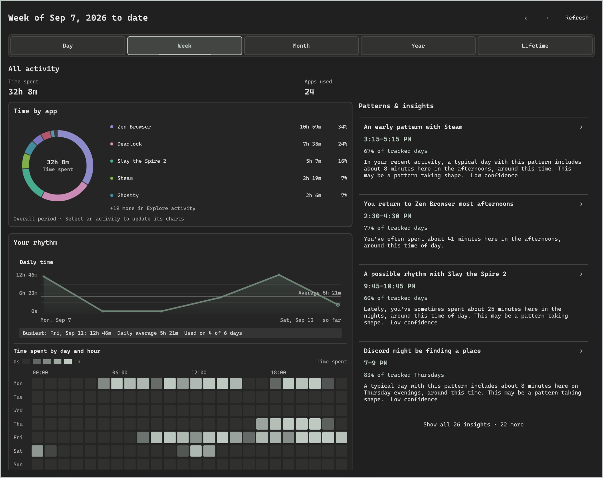
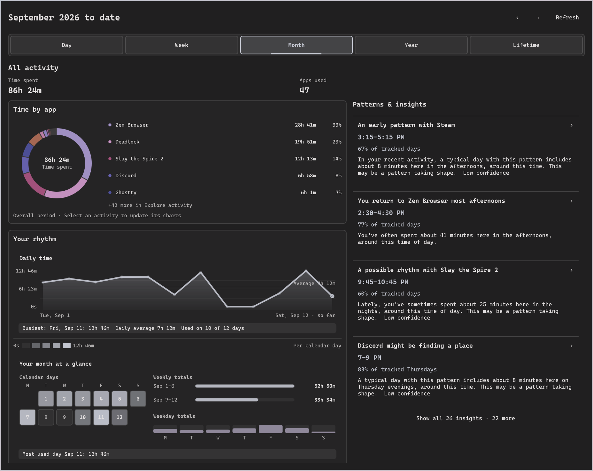
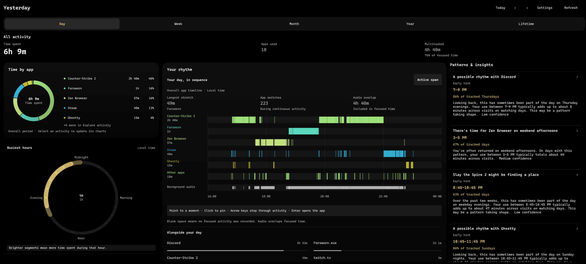

# Omastat

Local app and website activity tracking for **Arch Linux, Hyprland, and Omarchy
Quattro**. Open the bar widget to see where your time went, when you were active,
and which habits keep showing up. No timers, accounts, or cloud service.



- Browse a day, week, month, year, or your full history.
- Select an app or website to see its usage, visits, and patterns.
- Click a calendar day or chart point to open that period. Your selection follows you.
- Click an insight to see **How we know**, then return to the observations.

<details>
<summary>Month and day views</summary>





</details>

*Screenshots captured September 12, 2026, using real activity data.*

## Install

Requires a running Omarchy Quattro desktop, Git, jq, Cargo/Rust, and a C compiler.
Run as your normal user, without `sudo`:

```bash
git clone https://github.com/ThisIsRinesi/Omastat.git
cd Omastat
./install.sh
```

This installs the backend in `~/.cargo/bin`, starts the tracking service, and adds
the widget to your bar. Tracking starts immediately.

For website breakdowns in Zen or Firefox:

```bash
./install.sh --with-browser
```

The installer includes a Mozilla-signed extension for Firefox 140+ and compatible
Zen versions. Restart your browser and enable **Omastat Domain Tracker**, accepting
the browsing activity permission. Domains go only to your local Omastat app;
the native host automatically distinguishes Zen from Firefox.

If the extension does not appear, open `about:addons`, choose **Install Add-on
From File** from the gear menu, and select:

```text
~/.local/share/omastat/browser-extension/omastat-domain-tracker-firefox.xpi
```

The same signed file works in both browsers. If you use `XDG_DATA_HOME`, use that
directory instead of `~/.local/share`. See [browser setup](docs/USAGE.md) for details.

## Use

Click the bar widget to open the dashboard. Choose a period at the top; use the
arrows for earlier periods and **Today / This week / This month** to return.
Select **All activity** to clear an app or website selection.

Keyboard: **Tab** to move between controls, **Enter/Space** to select, **/** to
search, **R** to refresh, and **Escape** to clear the selection or close.

CLI reports and JSON/CSV exports are also available:

```bash
omastat today
omastat export-data --lens month --offset -1 --format csv --output ~/omastat-august
```

**Settings → Tracking status** shows the latest tracker heartbeat and browser
report, including idle, stopped, and stale states. It checks when Settings opens
and every 30 seconds while visible. Browser silence can mean the browser is
closed; it does not by itself diagnose a broken extension.

## Dashboard appearance

Open **Settings** in the dashboard to change its appearance. Choose **Narrow**,
**Normal**, or **Wide (4K)** to save your preferred width. Wide places activity,
rhythm charts, and insights in three columns; smaller screens automatically
fall back to a layout that fits. **Rich graphs**
adds curved trends, soft chart surfaces, gradient bars, and smoother entry and
selection transitions. It is enabled by default; turn it off for the classic
presentation. **Reduce motion** removes animated transitions and immediately
settles any in-progress chart reveal. These preferences persist with the widget's
other settings.

Time spent leads the summary; multitasked time is shown as a secondary duration
and share of focused time. Without insights, the layout places activity browsing
beside the rhythm charts. Hover or use arrow keys to inspect chart values;
trend selection survives refreshes and resets when changing periods.

Curves pass through the recorded values without overshooting them. The
multitasking overlay stays below focused time, and keyboard/hover readouts show
exact durations. Chart entry uses opacity and scale transforms, without
repainting canvas charts every animation frame.

## Optional Dynamic Island appearance

Enable **Dynamic Island appearance** in the Omastat widget settings. The black
dashboard expands inside the central notch when the optional Notchbar integration
is installed; other bars use a separate black panel. The full dashboard is
retained in both presentations. Disable the toggle to restore the standard appearance. The
`reduceMotion` widget setting disables the expansion animation.

The integration patch is `packaging/omarchy/notchbar-integration.patch`. It adds
a shared-content host to the user-owned `gustavo.notchbar` plugin's `Bar.qml`
and `CenterIsland.qml`; it is not applied by the standard installer.
Notchbar updates may require reapplying or adapting the patch. The appearance
falls back to the standalone panel if the shared-content API is unavailable.

## Privacy

Omastat counts foreground app use. Idle, locked, sleep, and unrecorded time are
excluded; active audio can keep a media session counted. Records stay in a local
SQLite database. Window titles are off by default. The optional browser extension
reports domains, not full URLs or page contents.

See [usage and configuration](docs/USAGE.md) for counting rules, privacy options,
exports, and deleting old records.

## Update or uninstall

Update the backend and widget together from your checkout:

```bash
git pull
./install.sh
```

Remove both, including the optional browser integration:

```bash
./uninstall.sh
```

Your recorded activity and configuration are kept. See [installation details](docs/USAGE.md#installation-and-removal)
for plugin backups and existing Git-managed installs.

[MIT license](LICENSE)

## Development checks

Run `packaging/dev/check.sh` for formatting, shell syntax, QML/JavaScript checks,
isolated installer tests, Rust tests, Clippy, and a locked release build. The
same command runs on pushes and pull requests in GitHub Actions. See
[check setup and dependencies](docs/CHECKS.md).

Installer file ownership: the user service and optional browser integration use
SHA-256 and mode receipts under `${XDG_STATE_HOME:-~/.local/state}/omastat/install-ownership`.
Installation backs up existing untracked or changed targets beside the original
as `filename.bak.<timestamp>`, following Omarchy’s config refresh convention
(with numbered suffixes for collisions), then installs the new version. This also
handles older installations without receipts. Backups are kept during uninstall.
Writes use temporary files and atomic replacement. Uninstall preserves
modified files, symlinks, and untracked browser storage contents. Keep the receipts
until uninstall is complete. Python 3 is required by these installers.
The user service runs `%h/.cargo/bin/omastatd` directly.
